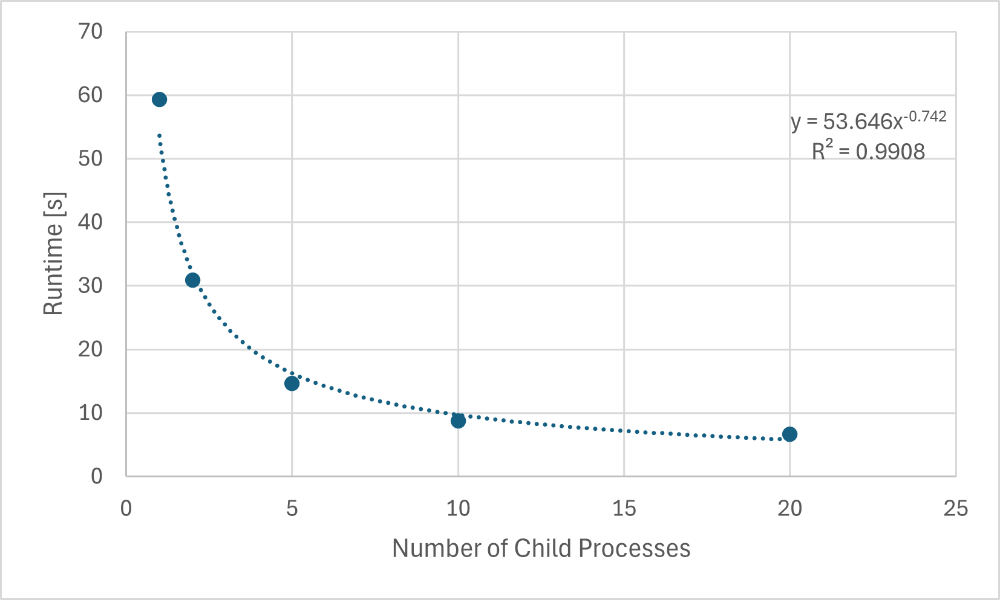
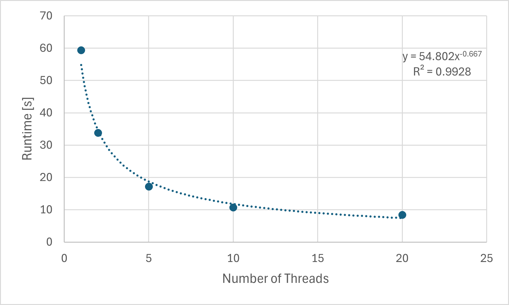
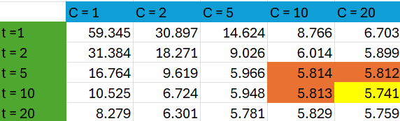

# System Programming Lab 11 Multiprocessing
## Spencer Thacker <thackers@msoe.edu>

This assignment aimed to modify the Mandel program to generate a movie and divide the workload among child processes.

As noted, I decided to use semaphore to manage the child processes for my implementation. The solution is simple and works quite well.

First, Semaphore limits the number of processes, and we then enter a for loop. In this loop, a fork statement is used to make a single child node, with the child node entering the if statement.

If you are the child node, you generate the image. The modified generation statement depends on the current frame that the statement had iterated into. Each parameter for the image is generated based on the given values. Once the image is made and released, sem_post is used to release the current semaphore and then exit the child process.

If you are the parent node, you iterate through the for loop once again making another child node. This repeats, increasing the number of child nodes until you are stopped by sem_wait, which means that the maximum number of child nodes is currently working. When sem_post is reached within a child process, the parent is allowed to make another child. The patient continues until all 0 - x numbers of frames are generated. At this point, the parent node waits for all child processes. Afterward, we close the Semaphore and unlink it.

## System Programming Lab 12  Multithreading

The goal of this assignment was to modify the Mandel movie program to generate the frames of the movie by dividing the workload among threads by modifying the function compute_image.

To utilize threads, I made a pointer function called compute_region, which contains the former functionality of the compute_image but uses a struct containing the data for a given thread to process.

This struct contacts prior data needed to compute a frame with added values of pointer to the frame that it will be generating and where the thread will start and end its processing.

Calculating the start and end values where the hardest part of this assignment. First, the number of rows per thread is found by taking the height of the image and dividing it by the number of threads. Then, the number of leftover rows is found by calculating the remainder of height over the number of threads.
Then a variable is used for keeping track of the current_start_row, which is initialized to zero.

Inside the loop that iterates through the number of threads, it sets the number of rows for the thread, and checks to see if the current thread is less than the remainder, if so it adds one. This check ensures that the image will always compute all rows by giving one extra to the first few threads.
Then the struct is initialized for that thread with given its values. Next, the variable current_start_row is updated to the current end row. Then thread is created using pthread_create, with the pointer function compute_region and thread struct containing its values. The for loop then iterates, creating the number of specified treads per image.
We then go to a for loop that waits for all the treads to be done.

## Runtime results

The figure above shows the Runtime over the number of Child processes for our default case, an "infinite" loop in Seahorse Valley. The trend line for the graph reveals that this is an Inverse Relationship between the Runtime number of Child processes. Our R^2 value tells us that the equation found in the figure is a good fit for predicting future values.

In conclusion, we were able to reduce runtime by distributing the task among child processes. The final movies can be found in “mandel.mpg”. It attempts to recreate an infinite loop in a location called “Sea Horse Valley”, but sadly I could not get it right.

The figure above shows the Runtime over the number of threads used to process an image. The trend line for the graph reveals that there is an inverse relationship between runtime and the number of threads. Our R^2 value tells us that the equation found in the figure is a good fit for the predicting values.

This figure demonstrates that we were able to reduce the runtime by distributing image processing between threads.

The Table above shows the number of threads VS the number of child processes to get runtime. 
Examining this table, we can see that as these both increase, generally, the runtime decreases, but looking closely, we can see that 5 threads and 20 child nodes return at the best time. Looking around this goldie locks zone, we see that the t = 5 and t = 10 for c = 10 have quite a similar time! This is quite odd, and I believe I have an explanation. For every ciled node c, there is a t number of threads used to compute that image which means that the true number of threads at any given time is (C * t). this causes us to reach the limitation of our hardware sooner than if we were just to increase the child processes. 

